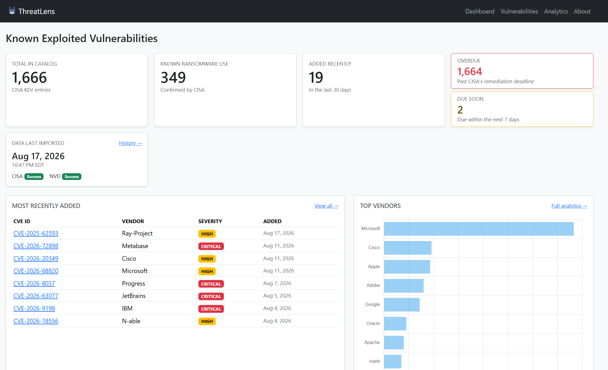

# ThreatLens

A cyber threat intelligence dashboard that ingests the CISA Known Exploited
Vulnerabilities (KEV) catalog through a repeatable ETL pipeline and presents it
as a searchable, filterable web application.

**Current version: v0.1** — CISA KEV ingestion, KPI dashboard, vulnerability
list with search and pagination, and detail pages.



---

## What it does

CISA maintains a catalog of vulnerabilities that are *known to be actively
exploited in the wild* — not theoretical risks, but attacks already happening.
The catalog is published as a single JSON file, which is machine-readable but
not usable as an analyst tool: no search, no filtering, no aggregate view.

ThreatLens turns that feed into an application. A scheduled-safe ETL pipeline
fetches the catalog, validates its structure, normalizes each record, and
upserts it into PostgreSQL. A Django front end then exposes the data as summary
metrics, a searchable table, and per-CVE detail pages.

At the time of writing, the catalog holds **1,662 vulnerabilities** across
**276 vendors**, of which **338** are confirmed by CISA to have been used in
ransomware campaigns.

---

## Architecture

```
CISA KEV feed  ──▶  ETL (Python)  ──▶  PostgreSQL  ──▶  Django  ──▶  Dashboard
                    extract
                    transform
                    load (upsert)
```

Ingestion is deliberately kept separate from the web application. The pipeline
is a Django management command that can be run by hand, by cron, or by a task
scheduler, and it never depends on an HTTP request being in flight.

Source-specific parsing lives in `threats/services/`, isolated per source, so
that adding a second feed means adding a module rather than adding branches to
an existing one.

---

## Tech stack

| Layer | Choice |
|---|---|
| Backend | Django 5, Python 3.13 |
| Database | PostgreSQL |
| ETL | `requests` + standard library, Django ORM for load |
| Front end | Django templates, Bootstrap 5 |
| Tests | Django test runner (41 tests) |

---

## Screenshots

| Vulnerability list | Detail page |
|---|---|
|  |  |

---

## Getting started

### Prerequisites

- Python 3.11 or newer
- PostgreSQL 14 or newer, running locally
- Git

### Setup

```bash
git clone https://github.com/<your-username>/cyber-dashboard.git
cd cyber-dashboard

python -m venv venv
source venv/bin/activate        # Windows: venv\Scripts\Activate.ps1

pip install -r requirements.txt
```

Create the database:

```bash
createdb threatdash
```

Create a `.env` file in the project root:

```env
SECRET_KEY=your-django-secret-key
DEBUG=True
DATABASE_NAME=threatdash
DATABASE_USER=postgres
DATABASE_PASSWORD=your-password
DATABASE_HOST=localhost
DATABASE_PORT=5432
```

Apply migrations and create an admin user:

```bash
python manage.py migrate
python manage.py createsuperuser
```

### Load the data

```bash
python manage.py import_cisa
```

Expect roughly `1662 created, 0 updated` on a first run. Then:

```bash
python manage.py runserver
```

Open http://127.0.0.1:8000/.

---

## The ETL pipeline

The importer is a management command with a real command-line interface:

```bash
python manage.py import_cisa                 # normal run
python manage.py import_cisa --dry-run       # extract and transform only, no writes
python manage.py import_cisa --show-errors   # list every skipped record
```

**Extract** requests the official feed with a timeout, validates the HTTP
status, confirms the payload is an object containing a `vulnerabilities` list,
and captures provenance (catalog version, release date, retrieval time). Any
structural surprise raises `KEVExtractError` rather than being parsed
optimistically.

**Transform** maps CISA's camelCase keys onto model field names, trims
whitespace the source ships with, converts ISO date strings into `date`
objects, and reduces the ransomware field to a boolean. A record that cannot be
transformed is collected into an error list rather than aborting the run — one
bad row should not cost you the other 1,661.

**Load** upserts on `cve_id`, which carries a uniqueness constraint at the
database level. The command is idempotent: running it twice in a row reports
`0 created, 1662 updated` and leaves the data unchanged.

The command exits non-zero on failure, so a scheduler can detect a broken run
rather than assuming success.

For a record-level walkthrough of the whole path, see
[docs/DATA_FLOW.md](docs/DATA_FLOW.md).

---

## Project layout

```
cyber-dashboard/
├── manage.py
├── requirements.txt
├── docs/
│   ├── DATA_FLOW.md
│   └── screenshots/
├── threatlens/                     # settings, root URLconf, WSGI
└── threats/
    ├── models.py                   # Vulnerability
    ├── views.py                    # dashboard, list, detail
    ├── urls.py
    ├── admin.py
    ├── management/commands/
    │   └── import_cisa.py          # ETL entry point
    ├── services/
    │   └── cisa.py                 # extract + transform, CISA-specific
    ├── templates/threats/
    └── tests/
        ├── test_transform.py       # pure-function parsing tests
        └── test_views.py           # request/response tests
```

---

## Data model

`Vulnerability` mirrors the KEV catalog, one row per CVE.

| Field | Type | Notes |
|---|---|---|
| `cve_id` | `CharField` | Unique — the upsert key and the URL slug |
| `vendor` | `CharField` | CISA's `vendorProject` |
| `product` | `CharField` | |
| `vulnerability_name` | `CharField` | |
| `date_added` | `DateField` | When CISA added it to the catalog |
| `description` | `TextField` | |
| `required_action` | `TextField` | CISA's prescribed remediation |
| `due_date` | `DateField` | Nullable — federal remediation deadline |
| `known_ransomware_use` | `BooleanField` | See note below |
| `source_updated_at` | `DateTimeField` | `auto_now` — when the ETL last touched this row |

**A note on `known_ransomware_use`.** CISA publishes `"Known"` or `"Unknown"`,
and `"Unknown"` means *not determined* — not *not ransomware*. The boolean
therefore reads as "confirmed ransomware-associated," and the interface labels
it that way throughout. A `False` value is never presented as evidence that a
vulnerability is unrelated to ransomware.

---

## Tests

```bash
python manage.py test threats
python manage.py test threats --keepdb    # faster reruns
```

41 tests, split into two groups:

- **Transform tests** run against a record copied verbatim from the live feed,
  with no database access, covering key mapping, date parsing, whitespace
  handling, the ransomware mapping (including unrecognized values), missing
  required fields, and duplicate CVE IDs in the source.
- **View tests** cover all three views, plus search, filtering, pagination
  edge cases, the empty-database state, and 404 handling.

---

## Roadmap

| Checkpoint | Version | Scope | Status |
|---|---|---|---|
| 0 | v0.0 | Django + PostgreSQL foundation | Done |
| 1 | v0.1 | CISA KEV ETL, dashboard, list, detail | **Done** |
| 2 | v0.2 | NVD enrichment — CVSS, severity, CWE | Next |
| 3 | v0.3 | Analytics page with charts | Planned |
| 4 | v0.4 | Accounts, watchlists, analyst notes | Planned |
| 5 | v0.5 | MITRE ATT&CK explorer | Planned |
| 6 | v0.6 | Scheduled incremental ETL with run tracking | Planned |
| 7 | v0.7 | Alert rules and priority scoring | Planned |
| 8 | v1.0 | Docker, logging, deployment | Planned |

Each checkpoint ends with a running, demonstrable application rather than a
half-finished feature.

---

## Data source and attribution

Vulnerability data comes from the
[CISA Known Exploited Vulnerabilities Catalog](https://www.cisa.gov/known-exploited-vulnerabilities-catalog),
published by the Cybersecurity and Infrastructure Security Agency as a U.S.
government work in the public domain.

This project reproduces that data for analysis and does not add, infer, or
modify vulnerability assessments. Where the source expresses uncertainty, the
interface preserves it.

---

## License

MIT
