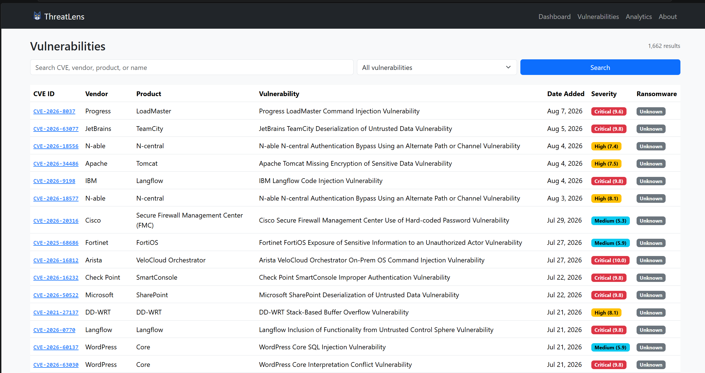
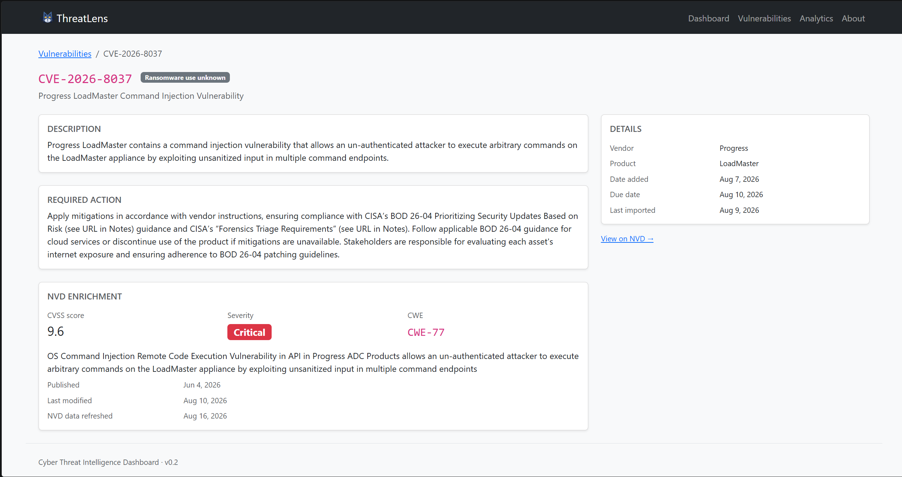

# ThreatLens by TL

A cyber threat intelligence dashboard that ingests the CISA Known Exploited
Vulnerabilities (KEV) catalog and NIST's National Vulnerability Database (NVD)
through repeatable ETL pipelines and presents it as a searchable, filterable
web application.

**Current version: v0.2** — CISA KEV ingestion, NVD enrichment (CVSS,
severity, CWE), KPI dashboard, vulnerability list with search and pagination,
and detail pages.


---

## What it does

CISA maintains a catalog of vulnerabilities that are *known to be actively
exploited in the wild* — not theoretical risks, but attacks already happening.
The catalog is published as a single JSON file, which is machine-readable but
not usable as an analyst tool: no search, no filtering, no aggregate view.

NVD, in turn, publishes far richer per-CVE data — CVSS scores, severity
ratings, CWE weakness classifications, and fuller descriptions — but only
reachable one CVE at a time through its own API.

ThreatLens turns both feeds into a single application. Two independent,
scheduled-safe ETL pipelines fetch, validate, and normalize this data, then
upsert it into PostgreSQL. A Django front end exposes the result as summary
metrics, a searchable table with severity indicators, and per-CVE detail
pages combining both sources.

At the time of writing, the catalog holds **1,662 vulnerabilities** across
**276 vendors**, of which **338** are confirmed by CISA to have been used in
ransomware campaigns. **1,656** of those have been enriched with NVD data.

---

## Architecture

```
CISA KEV feed  ──▶  ETL (Python)  ──┐
                                     ├──▶  PostgreSQL  ──▶  Django  ──▶  Dashboard
NVD API        ──▶  ETL (Python)  ──┘
                     extract
                     transform
                     load (upsert)
```

Ingestion is deliberately kept separate from the web application. Each pipeline
is a Django management command that can be run by hand, by cron, or by a task
scheduler, and neither depends on an HTTP request being in flight.

Source-specific parsing lives in `threats/services/`, isolated per source, so
that adding a source means adding a module rather than adding branches to an
existing one. CISA and NVD data are also stored in **separate models**
(`Vulnerability` and `NvdEnrichment`) so that refreshing one source can never
silently overwrite data owned by the other.

---

## Tech stack

| Layer | Choice |
|---|---|
| Backend | Django 5, Python 3.13 |
| Database | PostgreSQL |
| ETL | `requests` + standard library, Django ORM for load |
| Front end | Django templates, Bootstrap 5 |
| Tests | Django test runner (60 tests) |

---

## Screenshots

| Vulnerability list | Detail page |
|---|---|
|  |  |

---

## Getting started

### Prerequisites

- Python 3.11 or newer
- PostgreSQL 14 or newer, running locally
- Git

### Setup

```bash
git clone https://github.com/<your-username>/cyber-dashboard.git
cd cyber-dashboard

python -m venv venv
source venv/bin/activate        # Windows: venv\Scripts\Activate.ps1

pip install -r requirements.txt
```

Create the database:

```bash
createdb threatdash
```

Create a `.env` file in the project root:

```env
SECRET_KEY=your-django-secret-key
DEBUG=True
DATABASE_NAME=threatdash
DATABASE_USER=postgres
DATABASE_PASSWORD=your-password
DATABASE_HOST=localhost
DATABASE_PORT=5432

# Optional. Without this, NVD import works but is rate-limited to
# roughly 5 requests/30s. A free key raises that limit substantially.
# Request one at https://nvd.nist.gov/developers/request-an-api-key
NVD_API_KEY=your-nvd-api-key
```

Apply migrations and create an admin user:

```bash
python manage.py migrate
python manage.py createsuperuser
```

### Load the data

```bash
python manage.py import_cisa
```

Expect roughly `1662 created, 0 updated` on a first run. Then enrich it with
NVD data:

```bash
python manage.py import_nvd --only-missing --show-errors
```

This calls the NVD API once per CVE, so a full run over ~1,662 CVEs takes a
while without an API key (roughly 6 seconds/CVE to stay under NVD's public
rate limit). Test on a handful first:

```bash
python manage.py import_nvd --limit 10 --dry-run
```

Then start the server:

```bash
python manage.py runserver
```

Open http://127.0.0.1:8000/.

---

## The ETL pipelines

### CISA KEV

```bash
python manage.py import_cisa                 # normal run
python manage.py import_cisa --dry-run       # extract and transform only, no writes
python manage.py import_cisa --show-errors   # list every skipped record
```

**Extract** requests the official feed with a timeout, validates the HTTP
status, confirms the payload is an object containing a `vulnerabilities` list,
and captures provenance (catalog version, release date, retrieval time). Any
structural surprise raises `KEVExtractError` rather than being parsed
optimistically.

**Transform** maps CISA's camelCase keys onto model field names, trims
whitespace the source ships with, converts ISO date strings into `date`
objects, and reduces the ransomware field to a boolean. A record that cannot be
transformed is collected into an error list rather than aborting the run — one
bad row should not cost you the other 1,661.

**Load** upserts on `cve_id`, which carries a uniqueness constraint at the
database level. The command is idempotent: running it twice in a row reports
`0 created, 1662 updated` and leaves the data unchanged.

### NVD enrichment

```bash
python manage.py import_nvd                       # enrich every known CVE
python manage.py import_nvd --only-missing         # skip CVEs already enriched
python manage.py import_nvd --limit 10 --dry-run   # test without writing
python manage.py import_nvd --show-errors          # list every skipped CVE
```

**Extract** looks up each CVE ID already in the local database, one request at
a time, against NVD's public API. A CVE with no NVD record, or a request that
times out, is collected as an error rather than aborting the batch.

**Transform** picks the newest available CVSS version (`v3.1` → `v3.0` → `v2`,
since NVD may publish several at once), the English-language description, and
the CWE weakness classification.

**Load** upserts an `NvdEnrichment` row keyed to its `Vulnerability` by
`cve_id`. If a CVE exists in NVD but was never in CISA KEV, a bare
`Vulnerability` row is created for it automatically — `Vulnerability`
represents *a CVE*, not just *a KEV entry*, and the KEV-only fields
(`required_action`, `due_date`, `known_ransomware_use`) simply stay null for
that row. CISA-owned fields are never touched by this command, and vice versa.

Both commands exit non-zero on failure, so a scheduler can detect a broken run
rather than assuming success.

For a record-level walkthrough of the whole path, see
[docs/DATA_FLOW.md](docs/DATA_FLOW.md).

---

## Project layout

```
cyber-dashboard/
├── manage.py
├── requirements.txt
├── docs/
│   ├── DATA_FLOW.md
│   └── screenshots/
├── config/                          # settings, root URLconf, WSGI
└── threats/
    ├── models.py                    # Vulnerability, NvdEnrichment
    ├── views.py                     # dashboard, list, detail
    ├── urls.py
    ├── admin.py
    ├── management/commands/
    │   ├── import_cisa.py           # CISA KEV ETL entry point
    │   └── import_nvd.py            # NVD enrichment ETL entry point
    ├── services/
    │   ├── cisa.py                  # extract + transform, CISA-specific
    │   ├── nvd.py                   # extract + transform, NVD-specific
    │   └── loader.py                # shared upsert logic for both sources
    ├── templates/threats/
    └── tests/
        ├── test_transform.py        # CISA transform tests
        ├── test_nvd_transform.py    # NVD transform tests
        ├── test_loader.py           # upsert/load tests, both sources
        └── test_views.py            # request/response tests
```

---

## Data model

`Vulnerability` represents a CVE — one row per unique ID, regardless of which
source(s) reported it.

| Field | Type | Notes |
|---|---|---|
| `cve_id` | `CharField` | Unique — the upsert key and the URL slug |
| `vendor` | `CharField` | CISA's `vendorProject` |
| `product` | `CharField` | |
| `vulnerability_name` | `CharField` | |
| `description` | `TextField` | |
| `date_added` | `DateField` | Nullable — when CISA added it to KEV |
| `required_action` | `TextField` | Nullable — CISA's prescribed remediation |
| `due_date` | `DateField` | Nullable — federal remediation deadline |
| `known_ransomware_use` | `BooleanField` | Nullable — see note below |
| `source_updated_at` | `DateTimeField` | `auto_now` — when CISA's ETL last touched this row |

**A note on `known_ransomware_use`.** CISA publishes `"Known"` or `"Unknown"`,
and `"Unknown"` means *not determined* — not *not ransomware*. `True`/`False`
therefore reads as "confirmed ransomware-associated" for CISA-sourced rows.
`Null` means CISA never evaluated this CVE at all (an NVD-only CVE) — a
distinct, honest third state, never collapsed into `False`.

`NvdEnrichment` holds NVD's contribution for a CVE, one row per
`Vulnerability`, kept in its own table so a refresh of one source can never
overwrite data owned by the other.

| Field | Type | Notes |
|---|---|---|
| `vulnerability` | `OneToOneField` | Links to the `Vulnerability` this enriches |
| `nvd_description` | `TextField` | NVD's own description text |
| `cvss_score` | `FloatField` | Nullable — newest available CVSS version |
| `severity` | `CharField` | e.g. `CRITICAL`, `HIGH`, `MEDIUM`, `LOW` |
| `cwe_id` | `CharField` | e.g. `CWE-77` |
| `published_date` | `DateField` | Nullable — when NVD first published the CVE |
| `modified_date` | `DateField` | Nullable — when NVD last modified the CVE |
| `source_updated_at` | `DateTimeField` | `auto_now` — when NVD's ETL last touched this row |

---

## Tests

```bash
python manage.py test threats
python manage.py test threats --keepdb    # faster reruns
```

60 tests, split into four groups:

- **CISA transform tests** run against a record copied verbatim from the live
  feed, with no database access, covering key mapping, date parsing,
  whitespace handling, the ransomware mapping (including unrecognized
  values), missing required fields, and duplicate CVE IDs in the source.
- **NVD transform tests** run against a record shaped like a real NVD API
  response, with no database access, covering CVSS version fallback
  (v3.1 → v3.0 → v2), English-language filtering, CWE extraction, and
  malformed/missing dates.
- **Loader tests** cover both upsert paths against a real test database:
  idempotent reruns, and — most importantly — that enriching a CVE with NVD
  data never touches its CISA-owned fields, and that a CVE known only to NVD
  can create its own `Vulnerability` row.
- **View tests** cover all three views, plus search, filtering, pagination
  edge cases, the empty-database state, and 404 handling.

---

## Roadmap

| Checkpoint | Version | Scope | Status |
|---|---|---|---|
| 0 | v0.0 | Django + PostgreSQL foundation | Done |
| 1 | v0.1 | CISA KEV ETL, dashboard, list, detail | Done |
| 2 | v0.2 | NVD enrichment — CVSS, severity, CWE | **Done** |
| 3 | v0.3 | Analytics page with charts | Next |
| 4 | v0.4 | Accounts, watchlists, analyst notes | Planned |
| 5 | v0.5 | MITRE ATT&CK explorer | Planned |
| 6 | v0.6 | Scheduled incremental ETL with run tracking | Planned |
| 7 | v0.7 | Alert rules and priority scoring | Planned |
| 8 | v1.0 | Docker, logging, deployment | Planned |

Each checkpoint ends with a running, demonstrable application rather than a
half-finished feature.

---

## Data source and attribution

Vulnerability data comes from the
[CISA Known Exploited Vulnerabilities Catalog](https://www.cisa.gov/known-exploited-vulnerabilities-catalog),
published by the Cybersecurity and Infrastructure Security Agency, and the
[NVD API](https://nvd.nist.gov/developers/vulnerabilities), published by the
National Institute of Standards and Technology — both U.S. government works
in the public domain.

This project reproduces that data for analysis and does not add, infer, or
modify vulnerability assessments. Where a source expresses uncertainty, the
interface preserves it.

---

## License

MIT
