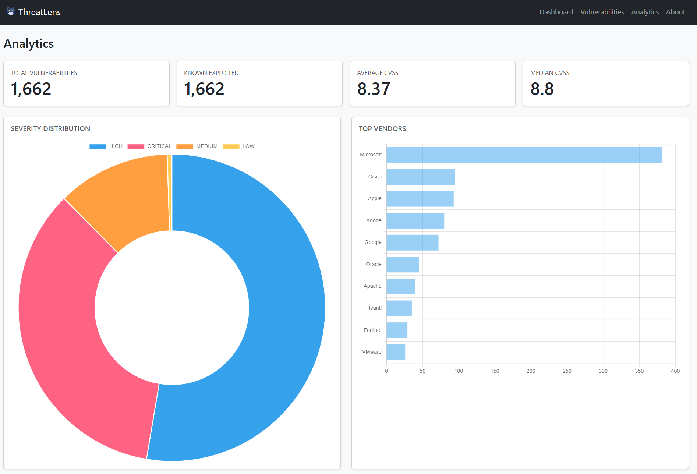
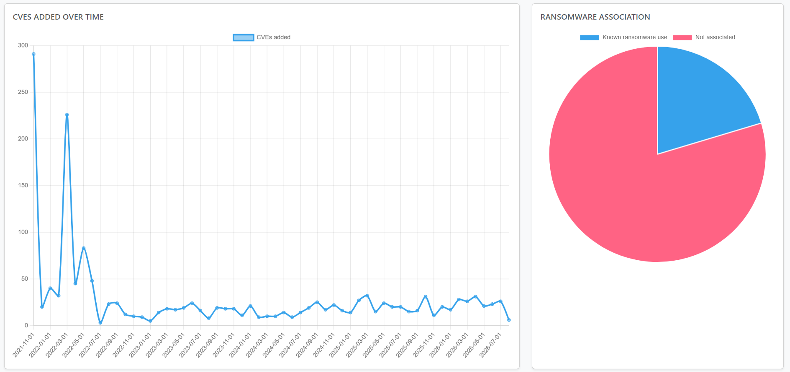
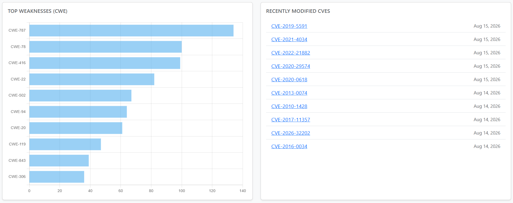

# ThreatLens by TL

A cyber threat intelligence dashboard that ingests the CISA Known Exploited
Vulnerabilities (KEV) catalog and NIST's National Vulnerability Database (NVD)
through repeatable ETL pipelines and presents it as a searchable, filterable
web application.

**Current version: v0.3**. Features so far: CISA KEV
ingestion, NVD enrichment (CVSS, severity, CWE), a KPI/triage dashboard,
vulnerability list with search and pagination, detail pages, an analytics
page with interactive charts, and scheduled ETL runs with full run-history
tracking.


---

## What it does

CISA maintains a catalog of vulnerabilities that are *known to be actively
exploited in the wild* - not theoretical risks, but attacks already happening.
The catalog is published as a single JSON file, which is machine-readable but
not usable as an analyst tool: no search, no filtering, no aggregate view.

NVD, in turn, publishes far richer per-CVE data - CVSS scores, severity
ratings, CWE weakness classifications, and fuller descriptions - but only
reachable one CVE at a time through its own API.

ThreatLens turns both feeds into a single application. Two independent,
scheduled-safe ETL pipelines fetch, validate, and normalize this data, then
upsert it into PostgreSQL. A Django front end exposes the result as summary
metrics, a searchable table with severity indicators, and per-CVE detail
pages combining both sources.

At the time of writing, the catalog holds **1,666 vulnerabilities** across
**276 vendors**, of which **349** are confirmed by CISA to have been used in
ransomware campaigns. **1,666** of those have been enriched with NVD data.

The catalog is currently scoped to CISA KEV entries only - `import_nvd`
enriches CVEs already known through KEV rather than discovering new,
non-KEV CVEs from NVD directly. Broader NVD-only coverage is optional scope
and remains on the backlog; every vulnerability in the database today is a
confirmed known-exploited CVE.

---

## Architecture

```
CISA KEV feed  ──▶  ETL (Python)  ──┐
                                     ├──▶  PostgreSQL  ──▶  Django  ──▶  Dashboard
NVD API        ──▶  ETL (Python)  ──┘
                     extract
                     transform
                     load (upsert)
```

Ingestion is deliberately kept separate from the web application. Each pipeline
is a Django management command that can be run by hand, by cron, or by a task
scheduler, and neither depends on an HTTP request being in flight.

Source-specific parsing lives in `threats/services/`, isolated per source, so
that adding a source means adding a module rather than adding branches to an
existing one. CISA and NVD data are also stored in **separate models**
(`Vulnerability` and `NvdEnrichment`) so that refreshing one source can never
silently overwrite data owned by the other.

---

## Tech stack

| Layer | Choice |
|---|---|
| Backend | Django 5, Python 3.13 |
| Database | PostgreSQL |
| ETL | `requests` + standard library, Django ORM for load |
| Front end | Django templates, Bootstrap 5 |
| Visualization | Chart.js |
| Scheduling | OS-level scheduler (Windows Task Scheduler / cron) + `refresh_all` |
| Tests | Django test runner (106 tests) |

---

## Screenshots

| Vulnerability list |
|---|
|  |

| Vulnerability's Detail page |
|---|
|  |

| Analytics |
|---|
|  |
|  |
|  |

---

## Getting started

### Prerequisites

- Python 3.11 or newer
- PostgreSQL 14 or newer, running locally
- Git

### Setup

```bash
git clone https://github.com/<your-username>/cyber-dashboard.git
cd cyber-dashboard

python -m venv venv
source venv/bin/activate        # Windows: venv\Scripts\Activate.ps1

pip install -r requirements.txt
```

Create the database:

```bash
createdb threatdash
```

Create a `.env` file in the project root:

```env
SECRET_KEY=your-django-secret-key
DEBUG=True
DATABASE_NAME=threatdash
DATABASE_USER=postgres
DATABASE_PASSWORD=your-password
DATABASE_HOST=localhost
DATABASE_PORT=5432

# Optional. Without this, NVD import works but is rate-limited to
# roughly 5 requests/30s. A free key raises that limit substantially.
# Request one at https://nvd.nist.gov/developers/request-an-api-key
NVD_API_KEY=your-nvd-api-key
```

Apply migrations and create an admin user:

```bash
python manage.py migrate
python manage.py createsuperuser
```

### Load the data

```bash
python manage.py import_cisa
```

Expect roughly `1662 created, 0 updated` on a first run. Then enrich it with
NVD data:

```bash
python manage.py import_nvd --only-missing --show-errors
```

This calls the NVD API once per CVE, so a full run over ~1,662 CVEs takes a
while without an API key (roughly 6 seconds/CVE to stay under NVD's public
rate limit). Test on a handful first:

```bash
python manage.py import_nvd --limit 10 --dry-run
```

Then start the server:

```bash
python manage.py runserver
```

Open http://127.0.0.1:8000/.

Once both commands work by hand, `python manage.py refresh_all` runs them
both in sequence - that's the single entry point a scheduler should call.
See [Automated ETL](#automated-etl) below.

---

## The ETL pipelines

### CISA KEV

```bash
python manage.py import_cisa                 # normal run
python manage.py import_cisa --dry-run       # extract and transform only, no writes
python manage.py import_cisa --show-errors   # list every skipped record
```

**Extract** requests the official feed with a timeout, validates the HTTP
status, confirms the payload is an object containing a `vulnerabilities` list,
and captures provenance (catalog version, release date, retrieval time). Any
structural surprise raises `KEVExtractError` rather than being parsed
optimistically.

**Transform** maps CISA's camelCase keys onto model field names, trims
whitespace the source ships with, converts ISO date strings into `date`
objects, and reduces the ransomware field to a boolean. A record that cannot be
transformed is collected into an error list rather than aborting the run - one
bad row should not cost you the other 1,661.

**Load** upserts on `cve_id`, which carries a uniqueness constraint at the
database level. The command is idempotent: running it twice in a row reports
`0 created, 1662 updated` and leaves the data unchanged.

### NVD enrichment

```bash
python manage.py import_nvd                       # enrich every known CVE
python manage.py import_nvd --only-missing         # skip CVEs already enriched
python manage.py import_nvd --limit 10 --dry-run   # test without writing
python manage.py import_nvd --show-errors          # list every skipped CVE
```

**Extract** looks up each CVE ID already in the local database, one request at
a time, against NVD's public API. A CVE with no NVD record, or a request that
times out, is collected as an error rather than aborting the batch.

**Transform** picks the newest available CVSS version (`v3.1` → `v3.0` → `v2`,
since NVD may publish several at once), the English-language description, and
the CWE weakness classification.

**Load** upserts an `NvdEnrichment` row keyed to its `Vulnerability` by
`cve_id`. If a CVE exists in NVD but was never in CISA KEV, a bare
`Vulnerability` row is created for it automatically - `Vulnerability`
represents *a CVE*, not just *a KEV entry*, and the KEV-only fields
(`required_action`, `due_date`, `known_ransomware_use`) simply stay null for
that row. CISA-owned fields are never touched by this command, and vice versa.

Both commands raise a non-zero exit code on a genuine failure (a broken feed,
an unreachable API), so a scheduler can detect it rather than assuming
success. A handful of individually skipped records is *not* treated as a
command failure - that's normal, expected noise on a live feed, and is
tracked as `rows_failed` on the run's history entry instead (see below)
rather than aborting the whole run.

For a record-level walkthrough of the whole path, see
[docs/DATA_FLOW.md](docs/DATA_FLOW.md).

---

## Automated ETL

Every run of `import_cisa` or `import_nvd` - whether triggered by hand or by
a scheduler - creates an `ETLRun` row recording its source, start/end time,
status, and how many rows were extracted/inserted/updated/failed. `/etl-status/`
shows the full history, and the dashboard's "Data last imported" card shows
each source's most recent status at a glance (`Success` / `Failed` / `No runs`).

**A note on timestamps.** The app stores and processes all datetimes in UTC
(`TIME_ZONE = 'UTC'` in settings), which is the right call for a database -
but showing raw UTC to a person reading the page is confusing. Rather than
guess a timezone server-side, timestamps are rendered with a small
`js-local-datetime` helper in `base.html` that converts them to the
*browser's* local timezone on page load. Any new page that prints a
datetime should reuse that pattern rather than printing
`{{ some_datetime|date:"..." }}` directly, or it'll show UTC instead of
local time - a real inconsistency the `/etl-status/` page had until this
was caught and fixed.

### Running both pipelines together

```bash
python manage.py refresh_all          # CISA + incremental NVD (only new CVEs)
python manage.py refresh_all --full   # CISA + full NVD refresh (re-enrich everything)
```

`refresh_all` is the single command a scheduler should call. It runs
`import_cisa` then `import_nvd` in sequence, and - importantly - still
attempts `import_nvd` even if `import_cisa` failed, since a broken CISA feed
shouldn't block NVD enrichment from proceeding.

**Why the default is incremental.** `import_nvd`'s default behavior is to
re-fetch NVD data for *every* CVE already in the database. NVD's public rate
limit (5 requests/30s without an API key) makes a full pass over a catalog
this size take hours, which is far too slow for any schedule shorter than
that and risks overlapping runs stacking up. Since a CVE's NVD data rarely
changes once set, `refresh_all` defaults to `--only-missing` (only enrich
CVEs that don't have NVD data yet) and only does a full re-enrichment when
`--full` is passed explicitly - run that occasionally by hand, not on a
frequent schedule.

### Scheduling it (Windows Task Scheduler)

1. **Task Scheduler → Create Task** (the full dialog, not "Basic Task").
2. **General**: name it, check "Run whether user is logged on or not."
3. **Triggers → New**: "On a schedule," Daily, then under Advanced settings
   check "Repeat task every" and pick an interval (hourly is fine now that
   the default is incremental) with a duration of "Indefinitely."
4. **Actions → New → Start a program**:
   - Program/script: full path to your venv's `python.exe`
   - Arguments: `manage.py refresh_all`
   - Start in: the project's root directory
5. Save. A failed run reports a non-zero exit code to Task Scheduler, and
   the full story - which source failed, why, and how many rows were
   affected - is always visible at `/etl-status/`, not just a pass/fail
   flag at the OS level.

On Linux/macOS, the equivalent is a cron entry running the same command -
the underlying `manage.py refresh_all` call doesn't change.

### Manual trigger from the browser

`/etl-status/` also has a **"Refresh data now"** button for triggering a
refresh on demand - useful for a quick update without waiting for the next
scheduled run, or as a substitute if you'd rather not set up OS-level
scheduling at all.

- Gated behind `@staff_member_required`: with no accounts system yet
  (Checkpoint 4), an unauthenticated "run the ETL now" button on a public
  site would let any visitor trigger outbound API calls on demand. Log in
  at `/admin/` with a superuser account to see the button.
- Runs `refresh_all` on a background thread rather than blocking the
  request, since NVD enrichment can take a while. The page redirects
  immediately with a "refresh started" message - reload `/etl-status/`
  after a minute to see the result. This is a lightweight stand-in for a
  real task queue (Celery), reasonable for a single-developer deployment
  but not how you'd want this to work with multiple app server processes.

Covered by
[`threats/tests/test_etl.py`](threats/tests/test_etl.py): the `ETLRun`
model's status transitions, both commands' success/failure paths,
`refresh_all`'s orchestration - including a regression test for a bug this
feature fixed (`import_nvd` used to call a bare `exit(1)` whenever any CVE
was skipped, which would have silently killed a scheduled `refresh_all` run
partway through via an uncaught `SystemExit`) - and the refresh button's
staff-only access control.

---

## Analytics

`/analytics/` turns the raw catalog into answers to the questions an analyst
actually asks:

| Chart | Question it answers |
|---|---|
| Severity distribution | How much of the catalog is Critical/High/Medium/Low? |
| Top vendors | Which vendors show up most often? |
| CVEs added over time | Is exploited-vulnerability activity increasing? |
| Ransomware association | How many known exploited CVEs tie to ransomware? |
| Top weaknesses (CWE) | Which weakness categories recur most? |
| Average / median CVSS | What's the overall severity profile? |
| Recently modified CVEs | What changed recently and may need re-review? |

Two implementation notes worth knowing:

- **Median CVSS is computed in Python**, not the database - Django has no
  built-in median aggregate, and pulling the raw scores and calling
  `statistics.median()` is simple and fully portable across database
  backends at this data volume.
- **NVD's `NVD-CWE-noinfo` and `NVD-CWE-Other` placeholders are excluded**
  from the top-weaknesses chart. Both mean "NVD could not determine a CWE"
  - including them would let an "unknown" bucket dominate a chart whose
  whole purpose is showing real weakness categories.

Every chart, and the empty-database state, is covered by
[`threats/tests/test_analytics.py`](threats/tests/test_analytics.py).

---

## Project layout

```
cyber-dashboard/
├── manage.py
├── requirements.txt
├── docs/
│   ├── DATA_FLOW.md
│   └── screenshots/
├── config/                          # settings, root URLconf, WSGI
└── threats/
    ├── models.py                    # Vulnerability, NvdEnrichment, ETLRun
    ├── views.py                     # dashboard, list, detail, analytics, etl_status
    ├── urls.py
    ├── admin.py
    ├── management/commands/
    │   ├── import_cisa.py           # CISA KEV ETL entry point
    │   ├── import_nvd.py            # NVD enrichment ETL entry point
    │   └── refresh_all.py           # scheduler entry point - runs both in sequence
    ├── services/
    │   ├── cisa.py                  # extract + transform, CISA-specific
    │   ├── nvd.py                   # extract + transform, NVD-specific
    │   └── loader.py                # shared upsert logic for both sources
    ├── templates/threats/
    │   ├── dashboard.html
    │   ├── vulnerability_list.html
    │   ├── vulnerability_detail.html
    │   ├── analytics.html           # severity, vendor, time, CWE, CVSS charts
    │   └── etl_status.html          # full ETL run history
    └── tests/
        ├── test_transform.py        # CISA transform tests
        ├── test_nvd_transform.py    # NVD transform tests
        ├── test_loader.py           # upsert/load tests, both sources
        ├── test_views.py            # request/response tests
        ├── test_analytics.py        # analytics aggregation + empty-state tests
        └── test_etl.py              # ETLRun model, both commands, refresh_all
```

---

## Data model

`Vulnerability` represents a CVE - one row per unique ID, regardless of which
source(s) reported it.

| Field | Type | Notes |
|---|---|---|
| `cve_id` | `CharField` | Unique - the upsert key and the URL slug |
| `vendor` | `CharField` | CISA's `vendorProject` |
| `product` | `CharField` | |
| `vulnerability_name` | `CharField` | |
| `description` | `TextField` | |
| `date_added` | `DateField` | Nullable - when CISA added it to KEV |
| `required_action` | `TextField` | Nullable - CISA's prescribed remediation |
| `due_date` | `DateField` | Nullable - federal remediation deadline |
| `known_ransomware_use` | `BooleanField` | Nullable - see note below |
| `source_updated_at` | `DateTimeField` | `auto_now` - when CISA's ETL last touched this row |

**A note on `known_ransomware_use`.** CISA publishes `"Known"` or `"Unknown"`,
and `"Unknown"` means *not determined* - not *not ransomware*. `True`/`False`
therefore reads as "confirmed ransomware-associated" for CISA-sourced rows.
`Null` means CISA never evaluated this CVE at all (an NVD-only CVE) - a
distinct, honest third state, never collapsed into `False`.

`NvdEnrichment` holds NVD's contribution for a CVE, one row per
`Vulnerability`, kept in its own table so a refresh of one source can never
overwrite data owned by the other.

| Field | Type | Notes |
|---|---|---|
| `vulnerability` | `OneToOneField` | Links to the `Vulnerability` this enriches |
| `nvd_description` | `TextField` | NVD's own description text |
| `cvss_score` | `FloatField` | Nullable - newest available CVSS version |
| `severity` | `CharField` | e.g. `CRITICAL`, `HIGH`, `MEDIUM`, `LOW` |
| `cwe_id` | `CharField` | e.g. `CWE-77` |
| `published_date` | `DateField` | Nullable - when NVD first published the CVE |
| `modified_date` | `DateField` | Nullable - when NVD last modified the CVE |
| `source_updated_at` | `DateTimeField` | `auto_now` - when NVD's ETL last touched this row |

`ETLRun` records one run of one ETL job. Kept per-source rather than a single
combined "last refresh" timestamp, so a failed NVD run stays visible even if
CISA's most recent run succeeded, and so history is auditable rather than
only ever showing the latest attempt.

| Field | Type | Notes |
|---|---|---|
| `source` | `CharField` | `cisa` or `nvd` |
| `status` | `CharField` | `running`, `success`, or `failed` |
| `started_at` | `DateTimeField` | `auto_now_add` |
| `finished_at` | `DateTimeField` | Nullable until the run completes |
| `rows_extracted` / `rows_inserted` / `rows_updated` / `rows_failed` | `PositiveIntegerField` | Set via `mark_success()` / `mark_failed()` |
| `error_message` | `TextField` | Populated only on failure, truncated to 5,000 characters |

Dry runs (`--dry-run`) don't create an `ETLRun` row - they write nothing to
the database, so there's nothing real to track a history of.

---

## Tests

```bash
python manage.py test threats
python manage.py test threats --keepdb    # faster reruns
```

106 tests, split into six groups:

- **CISA transform tests** run against a record copied verbatim from the live
  feed, with no database access, covering key mapping, date parsing,
  whitespace handling, the ransomware mapping (including unrecognized
  values), missing required fields, and duplicate CVE IDs in the source.
- **NVD transform tests** run against a record shaped like a real NVD API
  response, with no database access, covering CVSS version fallback
  (v3.1 → v3.0 → v2), English-language filtering, CWE extraction, and
  malformed/missing dates.
- **Loader tests** cover both upsert paths against a real test database:
  idempotent reruns, and - most importantly - that enriching a CVE with NVD
  data never touches its CISA-owned fields, and that a CVE known only to NVD
  can create its own `Vulnerability` row.
- **View tests** cover all three core views, plus search, filtering,
  pagination edge cases, the empty-database state, and 404 handling.
- **Analytics tests** cover every aggregation (severity distribution, top
  vendors, CVEs by month, ransomware split, average/median CVSS, recently
  modified ordering), confirm NVD's `NVD-CWE-noinfo`/`NVD-CWE-Other`
  placeholders never appear as a "top weakness," and confirm the page loads
  cleanly with an empty database instead of raising a division error on the
  CVSS average.
- **ETL tests** cover `ETLRun`'s status transitions, both commands' recording
  of a run on success and on failure (mocked so no real network call is
  made), `refresh_all`'s orchestration (including that `import_nvd` still
  runs even if `import_cisa` fails), a regression test for a bug this
  feature fixed (`import_nvd` used to call `exit(1)` whenever any CVE was
  skipped, which would have silently killed a scheduled `refresh_all` run
  partway through), and the manual refresh button's access control (hidden
  from anonymous visitors, rejected for non-staff users, POST-only).

---

## Roadmap

| Checkpoint | Version | Scope | Status |
|---|---|---|---|
| 0 | v0.0 | Django + PostgreSQL foundation | Done |
| 1 | v0.1 | CISA KEV ETL, dashboard, list, detail | Done |
| 2 | v0.2 | NVD enrichment - CVSS, severity, CWE | Done |
| 3 | v0.3 | Analytics page with charts | Done |
| 6 | v0.6 | Scheduled incremental ETL with run tracking | **Done** |
| 4 | v0.4 | Accounts, watchlists, analyst notes | Next |
| 5 | v0.5 | MITRE ATT&CK explorer | Planned |
| 7 | v0.7 | Alert rules and priority scoring | Planned |
| 8 | v1.0 | Docker, logging, deployment | Planned |

Checkpoint 6 was pulled ahead of 4 and 5 deliberately - scheduled, tracked
ETL doesn't depend on accounts or the ATT&CK layer, and having the catalog
stay current on its own is useful while those checkpoints are still being
built.

Each checkpoint ends with a running, demonstrable application rather than a
half-finished feature.

---

## Data source and attribution

Vulnerability data comes from the
[CISA Known Exploited Vulnerabilities Catalog](https://www.cisa.gov/known-exploited-vulnerabilities-catalog),
published by the Cybersecurity and Infrastructure Security Agency, and the
[NVD API](https://nvd.nist.gov/developers/vulnerabilities), published by the
National Institute of Standards and Technology - both U.S. government works
in the public domain.

This project reproduces that data for analysis and does not add, infer, or
modify vulnerability assessments. Where a source expresses uncertainty, the
interface preserves it.

---

## License

MIT
